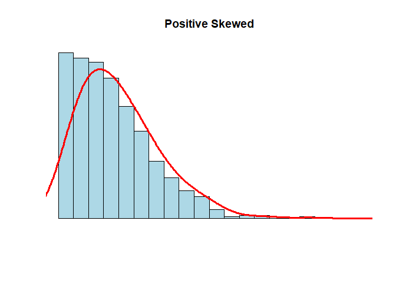

Atividade Avaliativa I
================
Bárbara Araújo Prates </br>
Estat 2021.2

------------------------------------------------------------------------

**Questão 01**

1)  O erro de Astrobaldo é que ele considerou a mala mais pesada sendo a
    que representa o valor do quartil superior e esqueceu de analisar
    que pelo boxplot existem malas mais pesadas entre esse quartil e o
    limite superior (29kg), onde está localizado 25% da amostra (malas).
    Portanto, 23kg não representa a mala mais pesada da distribuição.

2)  A mediana é representada pelo segundo quartil, assim, o seu valor é
    de 17kg

3)  A distância interquartílica é a diferença entre o quartil superior
    pelo quartil inferior, assim, a distância seria 23 − 10 = 13.

4)  A quantidade de malas presente entre 5kg e 10kg está no primeiro
    quartil que corresponde a 25% do total da amostra, assim,
    corresponderia a 25% de 240 malas, ou seja, 60 malas.

**Questão 02**

Questão 2 Obtive a soma de todas as médias dos 30 alunos, multiplicando
30 pela média aritmética das notas, ou seja, 6.40 encontrando como
resultado 192. Da mesma forma, obtive a soma total das médias dos outros
50 alunos da outra turma, multiplicando o total de alunos (50) por 5.20
tendo como total 260. Feito isso, somei a soma total das médias das duas
turma (192+260=452) e dividi por 80 (total de alunos correspondente as
duas turmas) (452/80). Assim, obtive que a média aritmética dos 80
alunos é (a) 5.65.

**Questão 03**</br> (a) Para criar o vetor, utilizei o seguinte código

``` r
X  <- c ( 68 , 70 , 72 , 58 , 90 , 110 , 68 , 70 , 72 , 80 , 80 , 67 , 90 , 94 , 100 , 80 , 75 , 79 , 84 , 90 )
(110:58)
```

    ##  [1] 110 109 108 107 106 105 104 103 102 101 100  99  98  97  96  95  94  93  92
    ## [20]  91  90  89  88  87  86  85  84  83  82  81  80  79  78  77  76  75  74  73
    ## [39]  72  71  70  69  68  67  66  65  64  63  62  61  60  59  58

2)  Média = 79.85; Primeiro quartil = 70.0; Mediana = 79.5; Terceiro
    quartil = 90; Desvio padrão = 12.78681 Para encontrar essa resposta,
    utilizei os seguintes códigos

``` r
mean(X)
```

    ## [1] 79.85

``` r
quantile(X)
```

    ##    0%   25%   50%   75%  100% 
    ##  58.0  70.0  79.5  90.0 110.0

``` r
median(X)
```

    ## [1] 79.5

``` r
sd(X)
```

    ## [1] 12.78681

3)  No histograma, é possível perceber uma certa assimetria entre os
    valores, por isso, acredito que a mediana representaria melhor como
    medida central do conjunto de dados.

**Questão 04**

1)  Importei o dataset para o Rstudio com o seguinte código

``` r
frango_dieta <- readr::read_csv("dados/frango_dieta.csv")
```

    ## Rows: 578 Columns: 4
    ## ── Column specification ────────────────────────────────────────────────────────
    ## Delimiter: ","
    ## dbl (4): peso, tempo, frango, dieta
    ## 
    ## ℹ Use `spec()` to retrieve the full column specification for this data.
    ## ℹ Specify the column types or set `show_col_types = FALSE` to quiet this message.

``` r
frango_dieta
```

    ## # A tibble: 578 × 4
    ##     peso tempo frango dieta
    ##    <dbl> <dbl>  <dbl> <dbl>
    ##  1    42     0      1     1
    ##  2    51     2      1     1
    ##  3    59     4      1     1
    ##  4    64     6      1     1
    ##  5    76     8      1     1
    ##  6    93    10      1     1
    ##  7   106    12      1     1
    ##  8   125    14      1     1
    ##  9   149    16      1     1
    ## 10   171    18      1     1
    ## # … with 568 more rows

Ao analisar o dataset foi possível identificar que cada coluna
representava uma variável (peso, tempo, frango, dieta), cada linha
apresentava observações sobre as variáveis e cada célula apresentava uma
única observação, logo, este dataset está organizado na forma tidy

2)  Usando o código

``` r
mean(frango_dieta$peso)
```

    ## [1] 121.8183

Encontrei que a média do peso dos frangos é 121.8183

3)  Usando o código

``` r
sd(frango_dieta$peso)
```

    ## [1] 71.07196

Encontrei como desvio padrão o valor 71.07196

4)  A variável peso é quantitativa contínua. A variável tempo é
    quantitativa discreta A variável frango é qualitativa nominal A
    variável dieta é qualitativa nominal

**Questão 05** Rodando o seguinte código:

``` r
N <- 1000
x <- rnbinom(N, 4, .5)
hist(
x,
xlim = c(min(x), max(x)),
probability = T,
nclass = max(x) - min(x) + 1,
col = 'lightblue', xlab = ' ', ylab = ' ', axes = F,
main = 'Positive Skewed'
)
lines(density(x, bw = 1), col = 'red', lwd = 3)
```

<!-- -->

Analisando esse gráfico, é possível perceber que a disposição dos
valores é assimétrica, logo, a mediana é a melhor medida central para
representar esses dados.

**Questão 06**

1)  Importei o dataset com o código

``` r
dados_co2 <- readr::read_csv("dados/dados_co2.csv")
```

    ## Rows: 39 Columns: 13
    ## ── Column specification ────────────────────────────────────────────────────────
    ## Delimiter: ","
    ## dbl (13): ano, jan, fev, mar, abr, mai, jun, jul, ago, set, out, nov, dez
    ## 
    ## ℹ Use `spec()` to retrieve the full column specification for this data.
    ## ℹ Specify the column types or set `show_col_types = FALSE` to quiet this message.

``` r
dados_co2
```

    ## # A tibble: 39 × 13
    ##      ano   jan   fev   mar   abr   mai   jun   jul   ago   set   out   nov   dez
    ##    <dbl> <dbl> <dbl> <dbl> <dbl> <dbl> <dbl> <dbl> <dbl> <dbl> <dbl> <dbl> <dbl>
    ##  1  1959  315.  316.  316.  318.  318.  318   316.  315.  314.  313.  315.  315.
    ##  2  1960  316.  317.  317.  319.  320.  319.  318.  316.  314   314.  315.  316.
    ##  3  1961  317.  318.  318.  319.  320.  320.  318.  317.  315.  315.  316.  317.
    ##  4  1962  318.  318.  320.  320.  321.  320.  319.  317.  316.  315.  317.  318.
    ##  5  1963  319.  319.  320.  321.  322.  321.  320.  318.  316.  316.  317.  318.
    ##  6  1964  319.  320.  321.  321.  322.  322.  320.  319.  317.  317.  318.  319.
    ##  7  1965  319.  320.  321.  322.  322   322.  321.  319.  318.  317.  319.  319.
    ##  8  1966  320.  321.  322.  324.  324.  324.  322.  320.  318.  318.  320.  321.
    ##  9  1967  322.  322.  323.  324.  325.  324.  322.  321.  319.  319.  321.  322.
    ## 10  1968  322.  323.  324.  325.  325.  325.  324.  322.  320.  320.  321.  323.
    ## # … with 29 more rows

2)  Não está no formato tidy, pois, as colunas não representam
    variáveis, nesse caso, acredito que deveria haver 3 colunas (ano,
    mês, co2)

3)  Organizei o conjunto de dados na forma tidy com o seguinte código

``` r
dados_co2 %>%                
  pivot_longer(
    !ano,              
    names_to = "mes",    
    values_to = "ppm"  
  )
```

    ## # A tibble: 468 × 3
    ##      ano mes     ppm
    ##    <dbl> <chr> <dbl>
    ##  1  1959 jan    315.
    ##  2  1959 fev    316.
    ##  3  1959 mar    316.
    ##  4  1959 abr    318.
    ##  5  1959 mai    318.
    ##  6  1959 jun    318 
    ##  7  1959 jul    316.
    ##  8  1959 ago    315.
    ##  9  1959 set    314.
    ## 10  1959 out    313.
    ## # … with 458 more rows

4)  Produzi e salvei o arquivo com o seguinte código

``` r
co2_tidy <- dados_co2 %>%
  pivot_longer(
    !ano,
    names_to = "mes",
    values_to = "ppm"
      )
write_csv(co2_tidy, "dados/co2_tidy.csv.")
```

5)  Salvei na variável co2_tidy com o seguinte código

co2_tidy \<- read_csv(“dados/co2_tidy.csv”) Executei o seguinte código:

``` r
co2_tidy %>% 
  group_by(ano) %>% 
  summarise(media = round(mean(ppm), 2)) %>% 
  ggplot(aes(ano, media, group = 1)) + 
  geom_line(color = "blue", size = 1)
```

<!-- -->

Observando o gráfico, é possível perceber que a media da variável ppm
aumentou com o passar dos anos.

**Questão 07**

1)  Criei a tibble da seguinte forma:

``` r
tabela_tibble <- tibble::tribble(
  ~nome,       ~altura, ~peso,
  "Ana",       155,     50,
  "Ludmilla",  158,     61,
  "Cristina",  162,     65,
  "Tereza",    168,     68,
  "Patrícia",  170,     69,
  "Mariana",   170,     65,
  "Ana Paula", 172,     82,
  "Dirce",     173,     79
)
tabela_tibble
```

    ## # A tibble: 8 × 3
    ##   nome      altura  peso
    ##   <chr>      <dbl> <dbl>
    ## 1 Ana          155    50
    ## 2 Ludmilla     158    61
    ## 3 Cristina     162    65
    ## 4 Tereza       168    68
    ## 5 Patrícia     170    69
    ## 6 Mariana      170    65
    ## 7 Ana Paula    172    82
    ## 8 Dirce        173    79

2)  A variável nome é uma variável qualitativa nominal A variável altura
    é uma variável quantitativa contínua A variável peso é uma variável
    quantitativa contínua

3)  Calculei a média, mediana e desvio padrão da altura e peso usando os
    seguintes códigos

``` r
mean(tabela_tibble$peso)
```

    ## [1] 67.375

``` r
median(tabela_tibble$peso)
```

    ## [1] 66.5

``` r
sd(tabela_tibble$peso)
```

    ## [1] 10.04188

``` r
mean(tabela_tibble$altura)
```

    ## [1] 166

``` r
median(tabela_tibble$altura)
```

    ## [1] 169

``` r
sd(tabela_tibble$altura)
```

    ## [1] 6.78233

Para a altura encontrei - média = 166 - mediana = 169

desvio padrão = 6.78233 Para o peso encontrei - média = 67.375 - mediana
= 66.5 - desvio padrão = 10.04188

Aparentemente, a relação observada é que, quanto maior o peso da pessoa,
maior é sua altura. Entretanto existe dois valores que distoam dessa
relação uma delas com o mesmo peso de 65kg porem maior do que a outra de
mesmo peso, e uma pesando acima de 80kg porém mais baixa do que a pessoa
que pesa proximo a 80kg.

4)  Executei o seguinte código

``` r
plot(tabela_tibble$peso, tabela_tibble$altura)
```

<!-- -->
